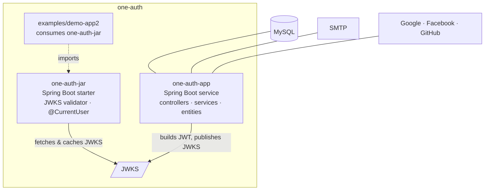
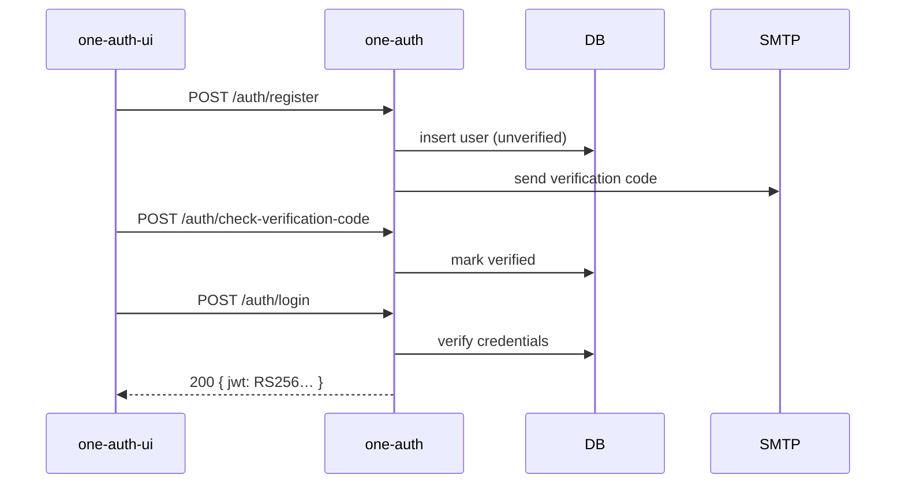
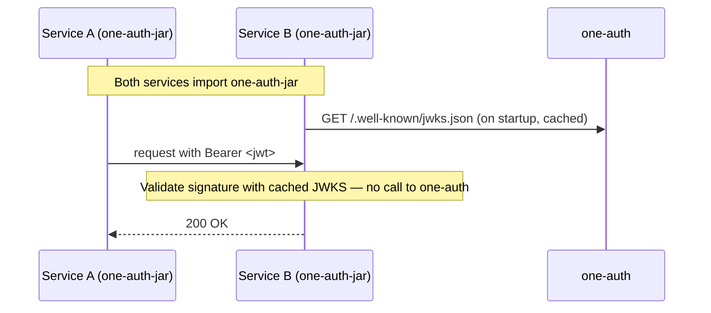

# one-auth

OAuth2 + JWT identity provider for the one-access platform. Spring Boot 3.5 on Java 17. Ships as both a standalone service (`one-auth-app`) and a drop-in Spring Boot starter that other services embed for JWT validation (`one-auth-jar`).

---

## Where it fits

```
 ┌────────────────┐     ┌────────────────┐     ┌──────────────────────────────┐
 │  infra-setup   │────▶│   infra-ops    │────▶│  app layer                   │
 │  (Terraform)   │     │  (Helm / K8s)  │     │  ┌──────────────────────┐    │
 │                │     │                │     │  │ one-auth ◀── you are │    │
 │                │     │                │     │  │           here       │    │
 │                │     │                │     │  └──────────┬───────────┘    │
 │                │     │                │     │             ▼  JWT + JWKS    │
 │                │     │                │     │  landing / dashboard / SDK   │
 └────────────────┘     └────────────────┘     └──────────────────────────────┘
```

Consumed by `one-auth-ui` (SDK) over HTTPS; consumed by sibling Java services by importing `one-auth-jar` and pointing at the JWKS endpoint.

---

## What it does

- Runs the user lifecycle — register → email verification → login → password reset → token exchange.
- Issues RS256-signed JWTs and publishes the public key at `/.well-known/jwks.json` so any service can verify tokens offline.
- Federates OAuth2 social login (Google, Facebook, GitHub) through Spring Security's OAuth2 client.

---

## Architecture



```
one-auth/
├── pom.xml                           # parent POM, manages both modules
├── one-auth-app/                     # the service (69 classes)
│   └── src/main/java/com/oneaccess/auth/
│       ├── SpringCustomizedStarterExampleApplication.java
│       ├── controller/  Auth, User, JWKS, ExceptionHandler
│       ├── services/    auth · user · mail · token-exchange
│       ├── security/    WebSecurityConfig, OAuth2 handlers, custom filters
│       ├── entities/    UserEntity
│       ├── repository/  Spring Data JPA
│       └── config/      cache, MVC, beans
├── one-auth-jar/                     # the library (15 classes)
│   └── src/main/java/com/oneaccess/authjar/
│       ├── config/      auto-configuration for downstream services
│       ├── service/     JWT validation against JWKS
│       ├── user/        @CurrentUser, principal extraction
│       └── validation/  custom validators
├── examples/demo-app2/               # reference consumer of one-auth-jar
├── Dockerfile                        # multi-stage Maven → JRE 17
└── docker-compose-local.yml          # app + MySQL for local dev
```

---

## API surface

| Method | Path | Purpose |
|--------|------|---------|
| POST | `/auth/login` | Email + password → JWT |
| POST | `/auth/register` | Create account, send verification email |
| GET  | `/auth/resend-verification-email` | Re-send the verification code |
| POST | `/auth/check-verification-code` | Verify the emailed code |
| POST | `/auth/send-forgot-password` | Start password-reset flow |
| POST | `/auth/process-password-reset` | Complete password reset |
| POST | `/auth/exchange` | Service-to-service token exchange |
| GET  | `/users/{id}` · `/users/me` · `/users/email-exists` | User lookups |
| GET  | `/.well-known/jwks.json` | Public key set for offline JWT verification |
| GET  | `/actuator/health` | Liveness / readiness |

---

## Key flows

### Register → verify → login


### Service-to-service call with offline JWT verification


---

## Core concepts

- **Dual-deployable monolith.** One repo produces both a runnable Spring Boot service (`one-auth-app`) and a reusable starter (`one-auth-jar`). Services that need the issuer run the app; services that only need to *verify* tokens import the jar.
- **JWKS-per-appId, offline verification.** Tokens are signed RS256. Each `appId` gets its own keypair, published at `/.well-known/jwks.json`. Downstream services cache the JWKS on startup and validate tokens without calling back to `one-auth`. Zero hot-path dependency on the auth server.
- **Hardened profile as a separable axis.** `application-security-hardened.yml` overlays the base `application.yml` with stricter CORS, header, and cookie defaults. Activated via Spring profile in production without changing code.
- **OAuth2 social via Spring Security's OAuth2 client.** Provider registrations live in config; adding a provider is a YAML block plus a client ID/secret, not a code change.
- **Short-lived OAuth2 cookie, long-lived JWT.** The OAuth2 redirect cookie (`OAUTH2_COOKIE_EXPIRE_SECONDS`, default 600) is scoped to the login exchange only. The issued JWT carries the session afterwards.
- **Allowed-origins and redirect-URIs split.** `APP_ALLOWED_ORIGINS` gates CORS; `OAUTH2_AUTHORIZED_REDIRECT_URIS` gates post-login redirects. Two lists, two threat models.

---

## Run it

```bash
# Docker (brings up MySQL too)
docker-compose -f docker-compose-local.yml up

# Or native
mvn clean package -DskipTests
java -jar one-auth-app/target/one-auth-app-0.0.1-SNAPSHOT.jar

# Health check
curl http://localhost:8080/actuator/health
```

Copy `example.env` → `dev.env`, fill in values, and pass it to Docker with `--env-file dev.env`.

---

## Configure it

Minimum set from `example.env`:

| Env var | Purpose |
|---------|---------|
| `SERVER_PORT` | HTTP port (default 8080) |
| `MYSQL_URL` · `MYSQL_PORT` · `MYSQL_ONEAUTH_DB_NAME` | Database connection |
| `MYSQL_ONEAUTH_USERNAME` · `MYSQL_ONEAUTH_PASSWORD` | DB credentials |
| `AUTH_SERVER_IDENTITY_KID` | JWKS key ID |
| `AUTH_SERVER_IDENTITY_PRIVATE_KEY` · `AUTH_SERVER_IDENTITY_PUBLIC_KEY` | RS256 keypair |
| `MAIL_HOST` · `MAIL_USERNAME` · `MAIL_PASSWORD` · `MAIL_PORT` | SMTP for verification + reset emails |
| `GOOGLE_CLIENT_ID` / `_SECRET` (also FACEBOOK, GITHUB) | OAuth2 social providers |
| `APP_ALLOWED_ORIGINS` | CORS whitelist |
| `OAUTH2_AUTHORIZED_REDIRECT_URIS` | Post-login redirect whitelist |
| `OAUTH2_COOKIE_EXPIRE_SECONDS` | OAuth2 flow cookie TTL |

Full reference: `one-auth-app/src/main/resources/application.yml`.

---

## Extend it

### Use `one-auth-jar` in another Spring Boot service

```xml
<dependency>
  <groupId>com.oneaccess</groupId>
  <artifactId>one-auth-jar</artifactId>
  <version>${one-auth.version}</version>
</dependency>
```

Point the consumer at the JWKS URL; auto-configuration wires JWT validation and exposes `@CurrentUser` for principal extraction. See `examples/demo-app2/`.

### Add an OAuth2 provider

Add a `spring.security.oauth2.client.registration.<name>` block to `application.yml`, set the `<NAME>_CLIENT_ID` / `<NAME>_CLIENT_SECRET` env vars, register the redirect URI in the provider console.

---

## Links

- Docs directory: [docs/](docs/)
- Reference consumer: [examples/demo-app2/](examples/demo-app2/)
- Client SDK: [../one-auth-ui/](../one-auth-ui/)
- Deployment chart: [../infra-ops/apps/one-auth/](../infra-ops/apps/one-auth/)
